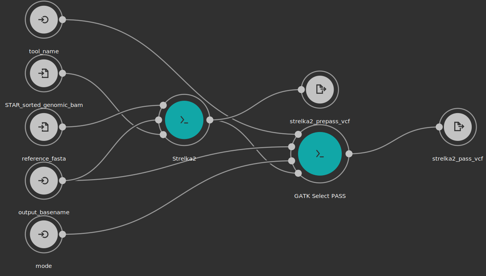
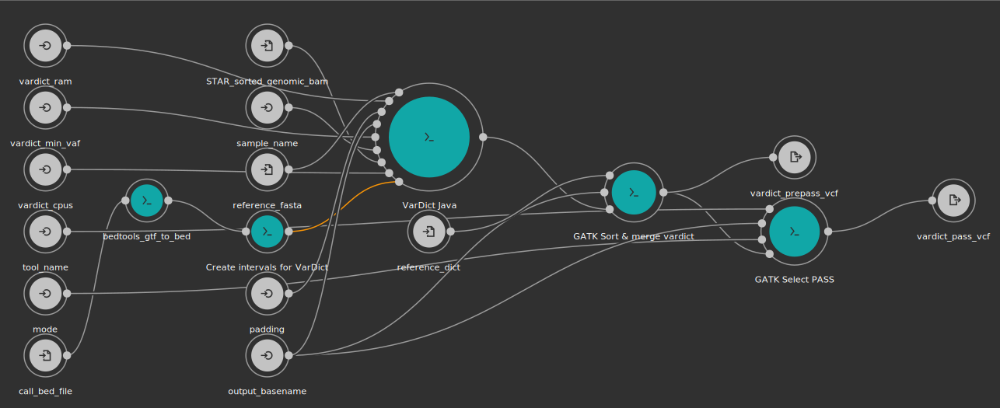

# RNAseq SNV Calling Workflow
This repo contains snv calling methods using Broad GATK best practices, Strelka2, and VarDict

<p align="center">
  
</p>

For all workflows,input bams should be indexed beforehand.  This tool is provided in `tools/samtools_index.cwl`

## GATK4 v4.1.1.0
The overall [workflow](https://gatk.broadinstitute.org/hc/en-us/articles/360035531192-RNAseq-short-variant-discovery-SNPs-Indels-) picks up from post-STAR alignment, starting at Picard mark duplicates.
For the most part, tool parameters follow defaults from the GATK Best Practices [WDL](https://github.com/gatk-workflows/gatk4-rnaseq-germline-snps-indels/blob/master/gatk4-rna-best-practices.wdl), written in cwl with added optimatization for use on the Cavatica platform.
`workflows/d3b_gatk_rnaseq_snv_wf.cwl` is the wrapper cwl used to run all tools for GAT4.

### Inputs
```yaml
inputs:
  output_basename: string
  STAR_sorted_genomic_bam: {type: File, doc: "STAR sorted alignment bam", secondaryFiles: ['^.bai']}
  sample_name: string
  reference_fasta: {type: File, secondaryFiles: ['.fai', '^.dict'], doc: "Reference genome used"}
  reference_dict: File
  vardict_min_vaf: {type: ['null', float], doc: "Min variant allele frequency for vardict to consider.  Recommend 0.2", default: 0.2}
  vardict_cpus: {type: ['null', int], default: 4}
  vardict_ram: {type: ['null', int], default: 8, doc: "In GB"}
  call_bed_file: {type: File, doc: "BED or GTF intervals to make calls"}
  tool_name: {type: string, doc: "description of tool that generated data, i.e. gatk_haplotypecaller"}
  padding: {type: ['null', int], doc: "Padding to add to input intervals, recommened 0 if intervals already padded, 150 if not", default: 150}
  mode: {type: ['null', {type: enum, name: select_vars_mode, symbols: ["gatk", "grep"]}], doc: "Choose 'gatk' for SelectVariants tool, or 'grep' for grep expression", default: "gatk"}
```

### Outputs
```yaml
outputs:
  haplotype_called__vcf: {type: File, outputSource: merge_hc_vcf/merged_vcf, doc: "Haplotype Caller called vcf, after genotyping"}
  filtered_vcf: {type: File, outputSource: gatk_filter_vcf/filtered_vcf, doc: "Called vcf after Broad-recommended hard filters applied"}
  pass_vcf: {type: File, outputSource: gatk_pass_vcf/pass_vcf, doc: "Filtered vcf selected for PASS variants"}
```

### Docker Pulls
 - `kfdrc/sambamba:0.7.1`
 - `kfdrc/gatk:4.1.1.0`
 - `kfdrc/python:2.7.13`

### Workflow Diagram


## Strelka2 v2.9.10
This [workflow](https://github.com/Illumina/strelka/blob/v2.9.x/docs/userGuide/README.md#rna-seq) is pretty straight forward, with a `PASS` filter step added to get `PASS` calls.
`workflows/d3b_strelka2_rnaseq_snv_wf.cwl` is the wrapper cwl that runs this workflow

### Inputs
```yaml
inputs:
  reference: { type: File, secondaryFiles: [.fai] }
  input_rna_bam: {type: File, secondaryFiles: [^.bai]}
  strelka2_bed: {type: File?, secondaryFiles: [.tbi], label: gzipped bed file}
  cores: {type: ['null', int], default: 16, doc: "Num cores to use"}
  ram: {type: ['null', int], default: 30, doc: "Max mem to use in GB"}
  output_basename: string
```

### Outputs
```yaml
  strelka2_prepass_vcf: {type: File, outputSource: strelka2_rnaseq/output_vcf, doc: "Strelka2 SNV calls"}
  strelka2_pass_vcf: {type: File, outputSource: gatk_pass_vcf/pass_vcf, doc: "Strelka2 calls filtered on PASS"}
```

### Docker Pulls
 - `kfdrc/strelka2:2.9.10`
 - `kfdrc/gatk:4.1.1.0`

### Workflow Diagram



## VardictJava v1.7.0
This [workflow](https://github.com/bcbio/bcbio-nextgen/blob/master/bcbio/rnaseq/variation.py) is based on the Vardict run style of BC Bio.
`workflows/d3b_vardict_rnaseq_snv_wf.cwl` is the wrapper cwl that runs this workflow.

### Inputs
```yaml
inputs:
  output_basename: string
  STAR_sorted_genomic_bam: {type: File, doc: "STAR sorted alignment bam", secondaryFiles: ['^.bai']}
  sample_name: string
  reference_fasta: {type: File, secondaryFiles: ['.fai', '^.dict'], doc: "Reference genome used"}
  reference_dict: File
  vardict_min_vaf: {type: ['null', float], doc: "Min variant allele frequency for vardict to consider.  Recommend 0.2", default: 0.2}
  vardict_cpus: {type: ['null', int], default: 4}
  vardict_ram: {type: ['null', int], default: 8, doc: "In GB"}
  call_bed_file: {type: File, doc: "BED or GTF intervals to make calls"}
  tool_name: {type: string, doc: "description of tool that generated data, i.e. gatk_haplotypecaller"}
  padding: {type: ['null', int], doc: "Padding to add to input intervals, recommened 0 if intervals already padded, 150 if not", default: 150}
  mode: {type: ['null', {type: enum, name: select_vars_mode, symbols: ["gatk", "grep"]}], doc: "Choose 'gatk' for SelectVariants tool, or 'grep' for grep expression", default: "gatk"}
```

### Outputs
```yaml
outputs:
  vardict_prepass_vcf: {type: File, outputSource: sort_merge_vardict_vcf/merged_vcf, doc: "VarDict SNV calls"}
  vardict_pass_vcf: {type: File, outputSource: gatk_pass_vcf/pass_vcf, doc: "VarDict calls filtered on PASS"}
```

### Docker Pulls
- `kfdrc/vardict:1.7.0`
- `kfdrc/gatk:4.1.1.0`
- `kfdrc/python:2.7.13`

### Workflow Diagram

